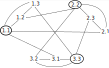
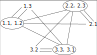

# Boolean networks simulator

## Description

This program simulates a specific family of dynamic boolean digraphs (called K\* digraphs).
For a given order, it generates the graph and calculates its **Φ** property, corresponding to the **maximum of fixed points** any function applied to the graph can get.

### Boolean network

A boolean network is a dynamic graph with each node being associated to a transition function which, in our case, will always return a boolean value.   
Each node can then be updated by applying this function with parent nodes values as parameters.

### K* digraph

A **K\* digraph** can be built in a similar way than a complete digraph (K digraph). But, it “expands” each node into several ones forming, for an order n K\* digraph, n groups of n nodes.   
Each of these groups is formed as a cycle containing one *representing* node.   

To build the digraph, we represent each node by coordinates.
The *x* value of these coordinates will always be the group the node belongs to. The *y* value will be its identifier within this group.
The representing node of each group will then be those where the x and the y value are the same.

Each representing node is then linked to every other node for which the *y* value is equal to its own *y* (and of course also *x* here) value.

Here's an example with order 3 K* digraph:

For the sake of optimization and simplicity, this program generates a simpler (but equivalent) version of K\* digraphs by fusing each representing node with its only parent. Here's an example still at order 3:

### Fixed points

Let *x* a set of boolean values applied to the nodes of the graph.
Given *f* the current transition function of the graph, *x* is a fixed point if *f(x) = x*.

In other words, *x* is a fixed point if the set of values of the graph is still equals to *x* after all its nodes has been updated.

## Building the program

Run `build.sh` script. `.class` files are stored in the `bin/` folder.
This script also generates the Javadoc files and stores them into `doc/` folder.

## Run the program

Run `run.sh` script.

The following command will compute the simulation with the K\* graph at order `x` (with `x` an integer with minimum value of 3):

	$ run.sh x

If no parameter `x` is given, the simulation will run with K\* graph at order `x`.

By default, the simulation will display percentages of running progression. To disable that functionality, add the `-n` option after `x`. For example:

	$ run.sh x -n

>> Warning: the complexity of this program is growing exponentially with the order of the K* digraph. The simulation can take a lot of time to compute even at small orders.

## Bug reports

If you find any bug while running the simulation, please open an *issue* on the Github repository's *issue tracker*. Explain clearly how the bug happened and when.
No special structure in the bug report is needed.

If you have any improvement suggestion, please also open an *issue* in the same *issue tracker*.

## Contributing

You can modify the code by forking the repository on your account. If you then want to add your own modifications to the main repository, please open a *pull request* explaining your modifications.